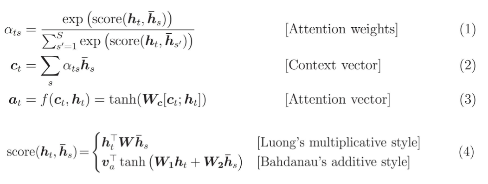
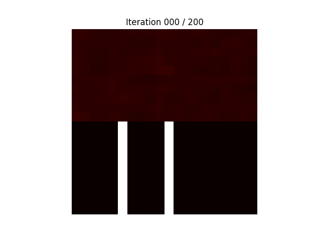
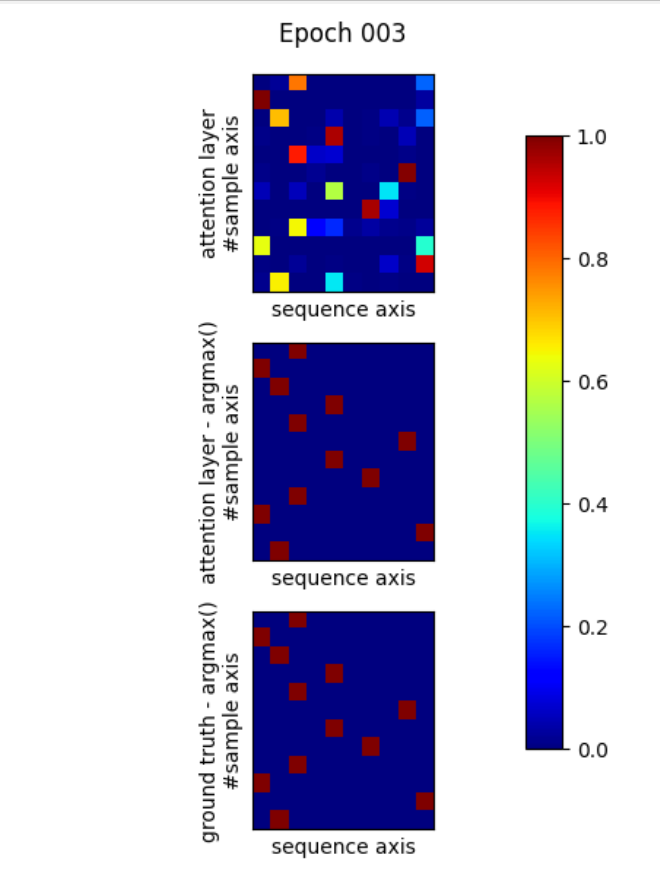

# Keras Attention Mechanism
[](https://github.com/philipperemy/keras-attention-mechanism/blob/master/LICENSE) [](https://www.tensorflow.org/) [](https://keras.io/) 


Many-to-one attention mechanism for Keras.

<p align="center">
  
</p>


## Installation

```bash
pip install attention
```

## Example

```python
import numpy as np
from tensorflow.keras import Input
from tensorflow.keras.layers import Dense, LSTM
from tensorflow.keras.models import load_model, Model

from attention import Attention


def main():
    # Dummy data. There is nothing to learn in this example.
    num_samples, time_steps, input_dim, output_dim = 100, 10, 1, 1
    data_x = np.random.uniform(size=(num_samples, time_steps, input_dim))
    data_y = np.random.uniform(size=(num_samples, output_dim))

    # Define/compile the model.
    model_input = Input(shape=(time_steps, input_dim))
    x = LSTM(64, return_sequences=True)(model_input)
    x = Attention(32)(x)
    x = Dense(1)(x)
    model = Model(model_input, x)
    model.compile(loss='mae', optimizer='adam')
    print(model.summary())

    # train.
    model.fit(data_x, data_y, epochs=10)

    # test save/reload model.
    pred1 = model.predict(data_x)
    model.save('test_model.h5')
    model_h5 = load_model('test_model.h5')
    pred2 = model_h5.predict(data_x)
    np.testing.assert_almost_equal(pred1, pred2)
    print('Success.')


if __name__ == '__main__':
    main()
```

## Other Examples

Browse [examples](examples).

Install the requirements before running the examples: `pip install -r examples/examples-requirements.txt`.


### IMDB Dataset

In this experiment, we demonstrate that using attention yields a higher accuracy on the IMDB dataset. We consider two
LSTM networks: one with this attention layer and the other one with a fully connected layer. Both have the same number
of parameters for a fair comparison (250K).

Here are the results on 10 runs. For every run, we record the max accuracy on the test set for 10 epochs.


| Measure  | No Attention (250K params) | Attention (250K params) |
| ------------- | ------------- | ------------- |
| MAX Accuracy | 88.22 | 88.76 |
| AVG Accuracy | 87.02 | 87.62 |
| STDDEV Accuracy | 0.18 | 0.14 |

As expected, there is a boost in accuracy for the model with attention. It also reduces the variability between the runs, which is something nice to have.


### Adding two numbers

Let's consider the task of adding two numbers that come right after some delimiters (0 in this case):

`x = [1, 2, 3, 0, 4, 5, 6, 0, 7, 8]`. Result is `y = 4 + 7 = 11`.

The attention is expected to be the highest after the delimiters. An overview of the training is shown below, where the
top represents the attention map and the bottom the ground truth. As the training  progresses, the model learns the 
task and the attention map converges to the ground truth.

<p align="center">
  
</p>

### Finding max of a sequence

We consider many 1D sequences of the same length. The task is to find the maximum of each sequence. 

We give the full sequence processed by the RNN layer to the attention layer. We expect the attention layer to focus on the maximum of each sequence.

After a few epochs, the attention layer converges perfectly to what we expected.

<p align="center">
  
</p>

## References

- https://www.cs.cmu.edu/~./hovy/papers/16HLT-hierarchical-attention-networks.pdf
- https://arxiv.org/abs/1508.04025
- https://arxiv.org/abs/1409.0473
- https://github.com/philipperemy/keras-attention-mechanism/issues/14
