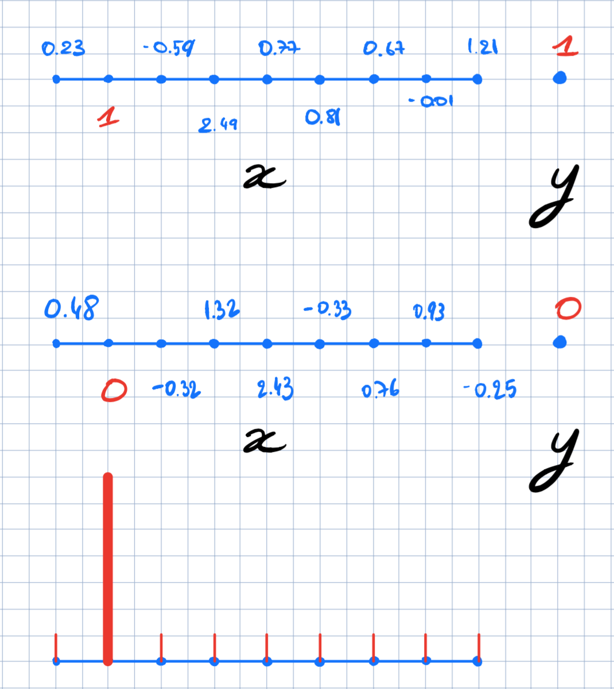
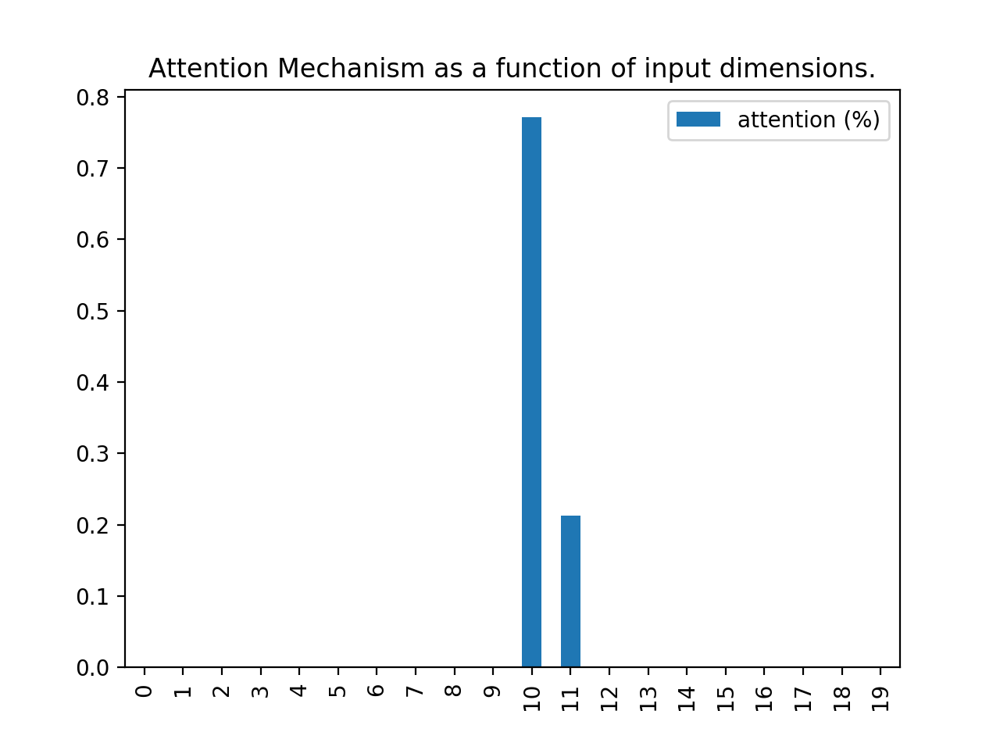
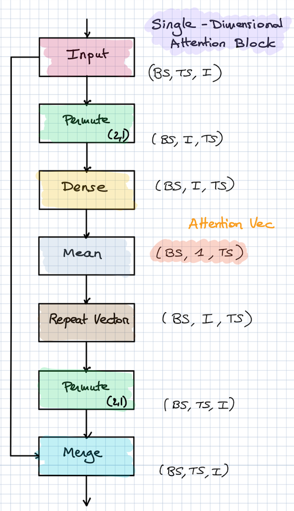

# Keras Attention Mechanism
[](https://github.com/philipperemy/keras-attention-mechanism/blob/master/LICENSE) [](https://www.tensorflow.org/) [](https://keras.io/) 

Simple attention mechanism implemented in Keras for the following layers:

- [x] **Dense (attention 2D block)**
- [x] **LSTM, GRU (attention 3D block)**

<p align="center">
  
  <br><i>Example: Attention block</i>
</p>

## Dense Layer

```
inputs = Input(shape=(input_dims,))
attention_probs = Dense(input_dims, activation='softmax', name='attention_probs')(inputs)
attention_mul = merge([inputs, attention_probs], output_shape=input_dims, name='attention_mul', mode='mul')
```

Let's consider this Hello World example:

- A vector *v* of 32 values as input to the model (simple feedforward neural network).
- *v[1]* = target.
- Target is binary (either 0 or 1).
- All the other values of the vector *v* (*v[0]* and *v[2:32]*) are purely random and do not contribute to the target.

We expect the attention to be focused on *v[1]* only, or at least strongly. We recap the setup with this drawing:

<p align="center">
  <b>Attention Mechanism explained</b><br><br>
  
</p>


The first two are samples taken randomly from the training set. The last plot is the attention vector that we expect. A high peak indexed by 1, and close to zero on the rest.

Let's train this model and visualize the attention vector applied to the inputs:

<p align="center">
  <b>Attention Mechanism explained</b><br><br>
  
</p>

We can clearly see that the network figures this out for the inference.

### Behind the scenes

The attention mechanism can be implemented in three lines with Keras:
```
inputs = Input(shape=(input_dims,))
attention_probs = Dense(input_dims, activation='softmax', name='attention_probs')(inputs)
attention_mul = merge([inputs, attention_probs], output_shape=32, name='attention_mul', mode='mul')
```

We apply a `Dense - Softmax` layer with the same number of output parameters than the `Input` layer. The attention matrix has a shape of `input_dims x input_dims` here.

Then we merge the `Inputs` layer with the attention layer by multiplying element-wise.

Finally, the activation vector (probability distribution) can be derived with:

```
attention_vector = get_activations(m, testing_inputs_1, print_shape_only=True)[1].flatten()
```

Where `1` is the index of definition of the attention layer in the model definition (`Inputs` is indexed by `0`).

## Recurrent Layers (LSTM, GRU...)

### Application of attention at input level

We consider the same example as the one used for the Dense layers. The attention index is now on the 10th value. We therefore expect an attention spike around this value. There are two main ways to apply attention to recurrent layers:

- Directly on the inputs (same as the Dense example above): `APPLY_ATTENTION_BEFORE_LSTM = True`

<p align="center">
  <b>Attention vector applied on the inputs (before)</b><br><br>
  
</p>

### Application of attention on the LSTM's output

- After the LSTM layer: `APPLY_ATTENTION_BEFORE_LSTM = False`

<p align="center">
  <b>Attention vector applied on the output of the LSTM layer (after)</b><br><br>
  
</p>

Both have their own advantages and disadvantages. One obvious advantage of applying the attention directly at the inputs is that we clearly understand this space. The high dimensional space spanned by the LSTM might be a bit trickier to interpret, although they share the time steps in common with the inputs (`return_sequences=True` is used here).

### Attention of multi dimensional time series

Also, sometimes, the time series can be N-dimensional. It could be interesting to have one attention vector per dimension. Let's say we have a 2-D time series on 20 steps. Setting `SINGLE_ATTENTION_VECTOR = False` gives an attention vector of shape `(20, 2)`. If `SINGLE_ATTENTION_VECTOR` is set to `True`, it means that the attention vector will be of shape `(20,)` and shared across the input dimensions.

- `SINGLE_ATTENTION_VECTOR = False`

<p align="center">
  <b>Attention defined per time series (each TS has its own attention)</b><br><br>
  
</p>

- `SINGLE_ATTENTION_VECTOR = True`

<p align="center">
  <b>Attention shared across all the time series</b><br><br>
  
</p>

## Resources
- https://github.com/fchollet/keras/issues/1472
- http://distill.pub/2016/augmented-rnns/


